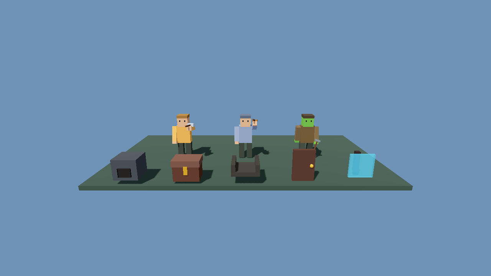
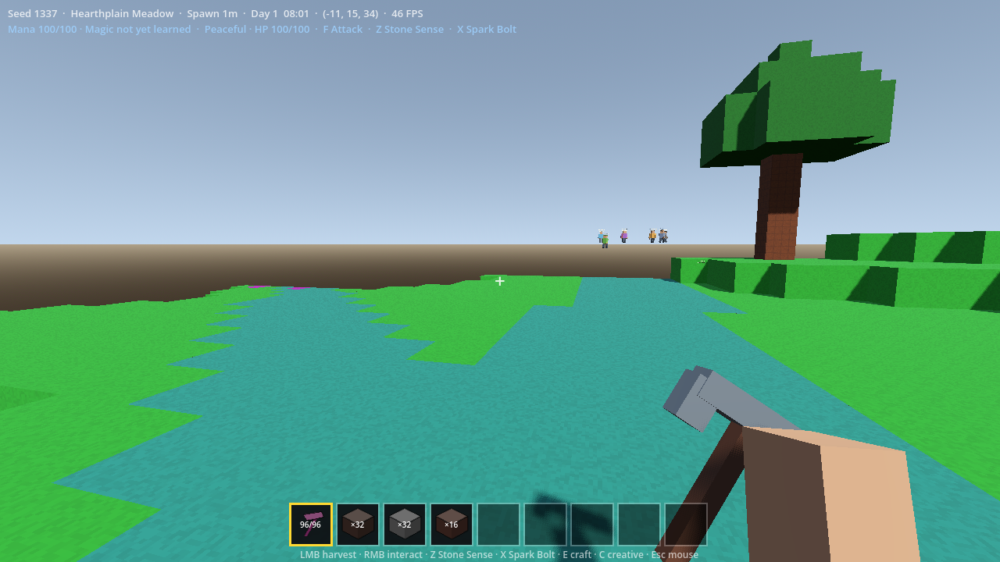

# Leyforge POC Manual Testing Guide

Version: 0.1  
Last updated: 23 July 2026  
Current implementation target: Stage 7 - Combat and Goblin Raid

## 1. Purpose and Maintenance Rule

This is the living manual acceptance guide for the Leyforge proof of concept.
It explains what has been implemented, how to reach it in the game, what to
observe, and what evidence to record when something is wrong.

From Stage 7 onward, every implementation phase must update this guide before
the phase is handed over for final manual testing. Automated probes remain
important, but they do not replace the visual, usability, and feel checks in
this document.

## 2. What the Current POC Contains

### Stage 1 - Voxel Editing Core

- Chunked voxel terrain, collision, streaming, and bounded mesh rebuilding.
- First-person WASD movement, mouse look, jumping, sprinting, swimming, slabs,
  stairs, block targeting, mining, placement, physical drops, and pickup.
- Nine-slot hotbar, backpack storage, 2x2 hand crafting, and atomic saves.

### Stage 2 - Controlled POC Valley

- Deterministic world seeds and a named, versioned valley plan.
- Guaranteed Forest Hamlet, warehouse, watchtower site, base site, river,
  cave, mana pocket, rune ruin, goblin camp, and raid approach.
- Connected roads/trails and multi-biome terrain.

### Stage 3 - Core Content and Crafting

- Separate stable block and item registries.
- Crude, stone, and iron tools with harvest level, speed, and durability.
- 2x2 and 3x3 shaped/shapeless crafting.
- Workbench, furnace, chest, iron/copper refining, slabs, stairs, shared
  material variation, and transactional outputs.

### Stage 4 - Persistent Forest Hamlet

- Eight named villagers with persistent identity, jobs, schedule, needs, home,
  work target, position, dialogue, and actor streaming.
- Warehouse, request board, reputation, permissions, exact deliveries, and
  staged watchtower construction by the builder.
- Villagers now use articulated humanoid models with head, torso, two arms,
  and two legs. Limbs swing while walking. Job tools appear in their hands and
  basic work, build, mine, chop, cast, guard, hurt, and attack poses are shown.

### Stage 5 - Resource-Conserving Automation

- Manual crank, Basic Mechanical Miner, item chutes, crates, furnace routing,
  warehouse hatches, persistent item batches, faults, cross-chunk connectors,
  audit records, and near/far simulation.
- Multiple simultaneous chute inputs now reserve furnace capacity correctly:
  coal enters the fuel lane, one compatible ore enters the processing lane,
  and an incompatible ore continues to storage.

### Stage 6 - Mana, Runes, and Wards

- Raw Mana Crystal to Mana Shard to Mana Dust resource chain.
- Rune Table, Basic Rune, Mana Furnace, Mana Battery, Mana Conduit, and Ward
  Lantern.
- Personal mana, Stone Sense, Spark Bolt, network faults, ward coverage,
  bounded simulation, and persistent ruin/broken-portal teaser.

### Stage 7 - Combat and Goblin Raid

- Player health, held-item melee attacks, Spark Bolt compatibility, enemy
  damage, guard combat, and humanoid goblin raider/brute/captain profiles.
- Persistent warning, assault, resolution, and aftermath phases.
- Raid preparation reads the watchtower, guard condition, warehouse food,
  lighting, and active ward coverage.
- Prepared Victory, Costly Victory, Partial Loss, and Village Defeat outcomes.
- Persistent injuries, theft, reputation effect, event history, damaged
  warehouse voxels, and transactional Oak Beam repairs.
- Player and goblin combat state survives save/load.

### Current Visual Model Pass

- The player uses the same articulated humanoid body proportions as villagers.
- First person always shows the player's arm. The selected block, tool, weapon,
  resource, or component appears in that hand.
- Pickaxes, axes, hammers, swords, staffs, crystals, runes, ingots, food, and
  blocks have distinct low-poly held/drop silhouettes.
- Furnace, Mana Furnace, chest/crate, item chute, door, workbench/rune table,
  torch/ward-style posts, and glass have authored voxel silhouettes.
- Glass is translucent and remains collidable.
- Inventory thumbnails distinguish priority functional-block shapes.

These are intentionally low-poly POC models. They establish identity,
animation hooks, proportions, and readability without locking the project to a
final art style or external asset pack.

## 3. Starting a Test

1. Open `D:\AI\Projects\leyforge` in Summer.
2. Run the project or open and run `res://main.tscn`.
3. For a completely fresh world, launch the project with the user argument
   `--new-world`. Keep a backup of any save you care about first.
4. Wait for the world and HUD to appear before moving.

The Windows save is normally under:

`%APPDATA%\Godot\app_userdata\Leyforge\leyforge_save.json`

Do not delete that file unless you intentionally want to discard the current
world. The game also maintains recovery/backup files beside it.

## 4. Controls

| Control | Action |
|---|---|
| W, A, S, D | Move |
| Mouse | Look |
| Space | Jump or swim upward |
| Shift | Sprint |
| Left Mouse (hold) | Mine the targeted voxel |
| Right Mouse | Place selected block or interact |
| F | Attack with the selected item or empty hand |
| Z | Cast Stone Sense after learning it |
| X | Cast Spark Bolt after learning it |
| E | Open/close 2x2 hand crafting |
| C | Open/close creative testing catalogue |
| 1-9 | Select hotbar slot |
| Mouse wheel | Cycle hotbar |
| Escape | Close UI or release mouse |

## 5. Fast Smoke Test

Run this after every new build before a longer playtest.

1. Confirm the world loads and the HUD shows seed, biome, landmark, time, mana,
   health/raid status, position, and FPS.
2. Walk, sprint, jump, look around, and mine one dirt or grass block.
3. Walk over the physical drop and confirm it enters the inventory.
4. Select an empty hotbar slot and confirm a first-person arm is visible.
5. Select a block and a pickaxe and confirm each appears in the hand.
6. Find a villager and confirm head, torso, arms, and legs are all present.
7. Watch a villager walk and confirm opposite arms/legs swing.
8. Open and close hand crafting with E.
9. Open the creative catalogue with C and close it with C or Escape.
10. Confirm there are no magenta missing-content blocks or frozen controls.

## 6. Visual Model Acceptance

### 6.1 Villagers

Test at least the builder, guard, miner, lumberjack, and mage.

- [ ] Each has a head, torso, two separate arms, and two separate legs.
- [ ] The face direction is readable from the eyes.
- [ ] Arms and legs move in opposite pairs while walking.
- [ ] Limbs return to a stable idle pose without vibrating.
- [ ] The builder holds a hammer and swings while building.
- [ ] The miner holds a pickaxe and shows a mining pose at work.
- [ ] The lumberjack holds an axe and shows a chopping pose at work.
- [ ] The mage holds a staff and shows a basic casting pose at work.
- [ ] The guard holds a sword and attacks goblins during a raid.
- [ ] Name/job labels remain legible and do not hide the body.

### 6.2 Player and First-Person Hand

- [ ] With an empty selected slot, the player's arm remains visible.
- [ ] A selected block appears as a small block model in the hand.
- [ ] A pickaxe has a handle and horizontal pick head.
- [ ] An axe, hammer, sword, staff, rune/crystal, and ingot are visually
      distinguishable.
- [ ] Mining swings the hand repeatedly.
- [ ] Placement, spell casting, and F attacks produce a basic swing/action.
- [ ] The first-person item does not cover the crosshair or most of the screen.
- [ ] The full player humanoid exists without the camera rendering the inside
      of its own head.

### 6.3 Functional Blocks

Use C to grant the following blocks, place them in daylight, and walk around
all sides.

- [ ] Stone Furnace has a raised stone shell and dark front firebox.
- [ ] Mana Furnace uses the same furnace silhouette with its magic colour.
- [ ] Wooden Chest/Crate has a lower body, raised lid, and front latch.
- [ ] Basic Item Chute reads as an open transport trough, not a solid cube.
- [ ] Oak Door is a thin upright panel with a visible handle.
- [ ] Workbench/Rune Table has a raised work surface and legs.
- [ ] Torch/Ward-style blocks use a narrow post silhouette.
- [ ] Glass Window is translucent; terrain and actors can be seen through it.
- [ ] Glass still blocks movement and can be mined.
- [ ] Inventory thumbnails distinguish furnace, chest, chute, and door.

Record any block whose silhouette is ambiguous, clips into neighbours, has
incorrect collision, or exposes invisible faces.

Reference render:



### 6.4 First-Person Reference

The expected held-pickaxe composition keeps the crosshair and most of the
hotbar unobstructed while leaving the arm and tool readable:



## 7. Stage-by-Stage Manual Tests

### 7.1 Terrain, Movement, and Persistence

1. Travel across grass, sand, snow, water, a slab, and a stair.
2. Mine and place at least five blocks across a chunk boundary.
3. Exit normally and reopen the game.
4. Confirm position, view direction, inventory, edits, drops, and functional
   block contents are restored.

Expected: no falling through terrain, invisible walls, duplicated drops, or
lost edits.

### 7.2 Crafting and Furnace

1. Craft Oak Planks and Sticks by hand.
2. Use a Workbench for a 3x3 tool or station recipe.
3. Put coal in furnace fuel and raw ore in input.
4. Confirm progress pauses if output is blocked.
5. Remove the output and confirm exact input/fuel counts.

### 7.3 Concurrent Furnace Routing Regression

Build one connected chute network ending in a Stone Furnace and a storage
crate. Feed one Iron Ore, one Coal, and one Copper Ore into the network close
together.

Expected:

- Coal reserves and reaches the furnace fuel slot.
- The first compatible ore reserves and reaches a furnace input.
- The other incompatible ore does not enter another empty furnace input.
- That ore continues through the chute network into storage.
- No item duplicates or disappears.

Repeat with copper arriving before iron; copper should become the active
furnace recipe and iron should continue to storage.

### 7.4 Forest Hamlet and Watchtower

1. Follow the road to the hamlet and speak to Elder Rowan.
2. Open the request board and deliver the current stage only.
3. Confirm reputation/permissions change at their documented thresholds.
4. Watch Talia place watchtower voxels one at a time.
5. Save/reload during construction and confirm the stage resumes.
6. Complete all four stages and confirm the project remains at 100%.

### 7.5 Automation

1. Place a Manual Crank beside a Basic Mechanical Miner.
2. Connect miner, chute, furnace or crate, and optionally a warehouse hatch.
3. Charge the crank and inspect the miner.
4. Lock an ore family with the Basic Wrench.
5. Confirm blocked/full/permission faults are readable.
6. Save while a batch is moving and reload.

Expected: exact quantities survive every transfer, blockage, and reload.

### 7.6 Mana, Runes, and Wards

1. Speak with Serin after helping the hamlet to learn POC magic.
2. Refine Raw Mana Crystal into Shards and Dust.
3. Craft a Rune Table and the Basic Rune components.
4. Connect a Mana Battery, conduits, Mana Furnace, and Ward Lantern.
5. Charge the battery and inspect network IDs/faults.
6. Run a Mana Furnace recipe and confirm exact mana is consumed on commit.
7. Stand near an active Ward Lantern and confirm coverage feedback.
8. Cast Z Stone Sense and X Spark Bolt.
9. Visit the rune ruin and inspect the broken portal teaser.

### 7.7 Combat and Goblin Raid

1. Speak to militia guard Elric Vale.
2. Select **Sound the Stage 7 raid warning**.
3. Confirm the HUD shows an eight-second warning before assault.
4. Watch non-combatants move toward shelter and Elric intercept goblins.
5. Confirm raiders, brute, and captain have humanoid silhouettes and weapons.
6. Fight with F and, if known, X. Confirm health and enemy count change.
7. Let the raid resolve or defeat all enemies.
8. Read the outcome and remaining repair count in the HUD/guard dialogue.
9. Inspect the warehouse perimeter for missing/damaged voxels after a
   non-perfect outcome.
10. Put Oak Beams in player inventory, speak to Elric, and select the repair
    action once per damaged voxel.
11. Confirm each repair consumes exactly one beam and restores the voxel.
12. Save/reload during warning, assault, and aftermath in separate runs.

Expected outcome influences:

| Preparation | Expected tendency |
|---|---|
| No tower, injured/unready guard, little food, no ward | Partial Loss or Village Defeat |
| Partial tower, ready guard, some food | Costly Victory or Partial Loss |
| Complete tower, ready guard, stocked food, active ward | Prepared Victory |

The automated Stage 7 acceptance probe separately forces at least three
preparation matrices to prove deterministic graded outcomes.

## 8. Save/Reload Checkpoints

Test these checkpoints independently:

- A physical item is on the ground.
- A furnace recipe is partway complete.
- An automation batch is in a chute.
- Watchtower construction is partway through a stage.
- A Mana Furnace is connected and powered.
- A ward is active.
- Raid warning is counting down.
- Goblins have taken damage during assault.
- Raid aftermath contains injuries, stolen stock, or damaged voxels.
- Some, but not all, damaged voxels have been repaired.

After reload, inspect both visible state and quantities.

## 9. Known Non-Blocking Development Warnings

The current Summer headless test runner can report:

- An invalid cached UID for `main.gd`, followed by successful text-path load.
- ObjectDB/RID leak warnings while the test process exits immediately.

Treat a `SCRIPT ERROR`, parse error, failed resource load, missing registry
content, crash, or gameplay transaction error as a real failure. Do not dismiss
it as one of the known shutdown warnings.

## 10. Bug Report Template

Copy this block when reporting a manual test failure:

```text
Build/commit:
Save seed:
Fresh world or existing save:
Guide section/test:
Expected:
Observed:
Exact steps to reproduce:
Does it reproduce after reload:
Screenshot/video:
Relevant held item/block/NPC:
Any on-screen or console error:
```

## 11. Final Test Sign-Off

Do not mark a phase manually accepted until:

- Its automated probes pass.
- The fast smoke test passes.
- The new phase section passes.
- Relevant save/reload checkpoints pass.
- Visual and interaction checks pass in the real Summer window.
- Every failure is fixed, explicitly deferred with a reason, or recorded as a
  known limitation.
