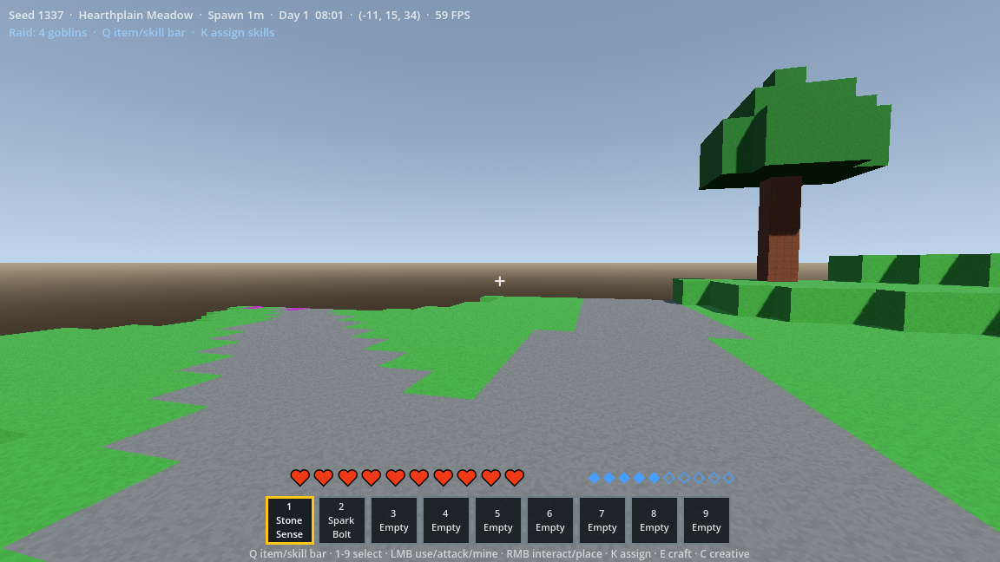
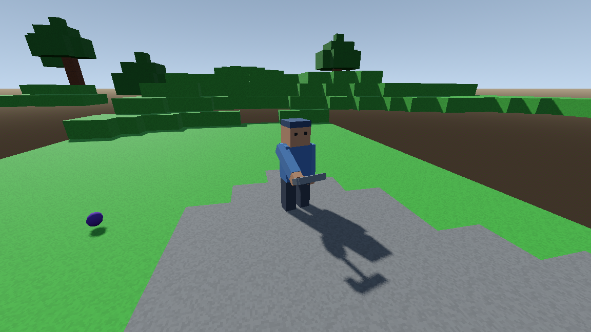
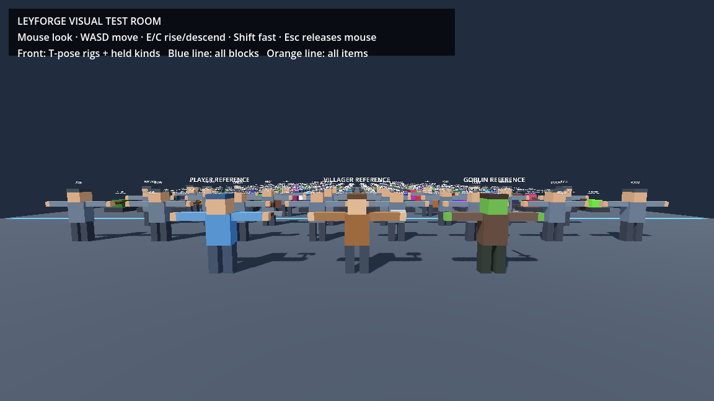
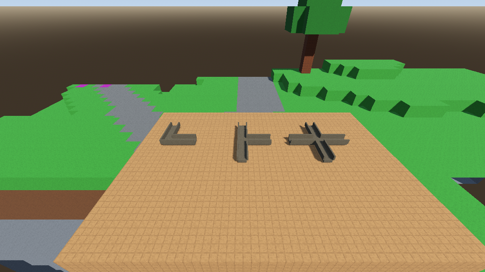
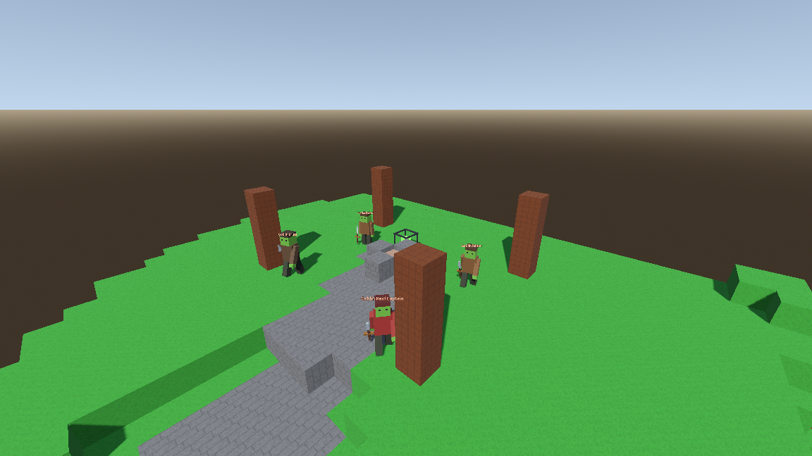
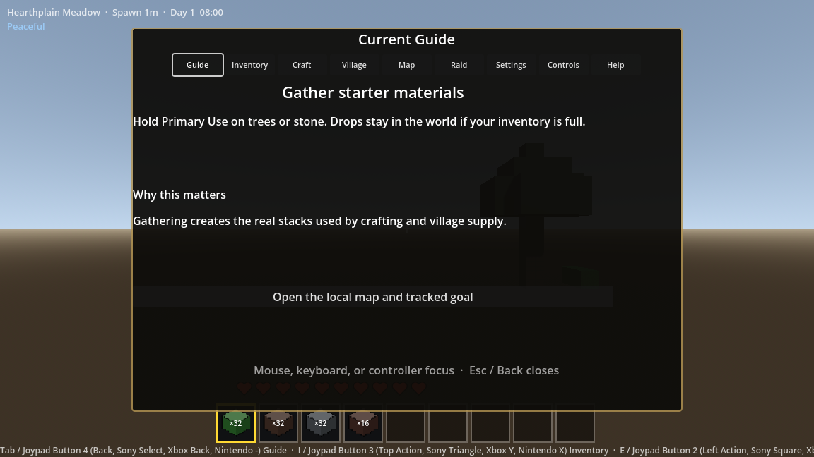
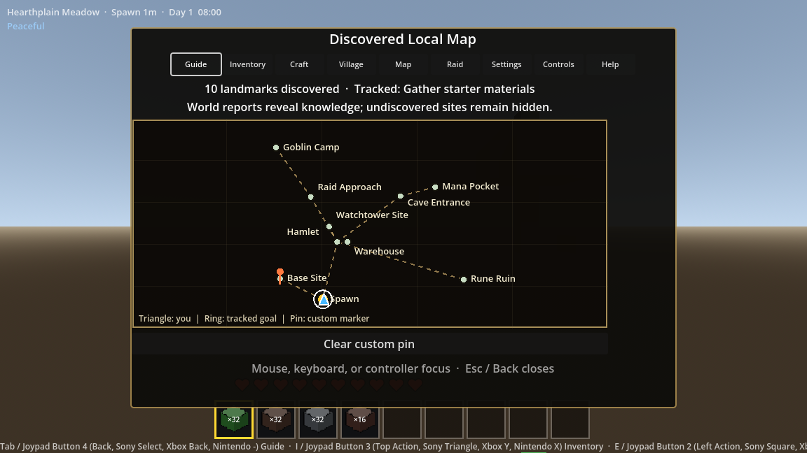
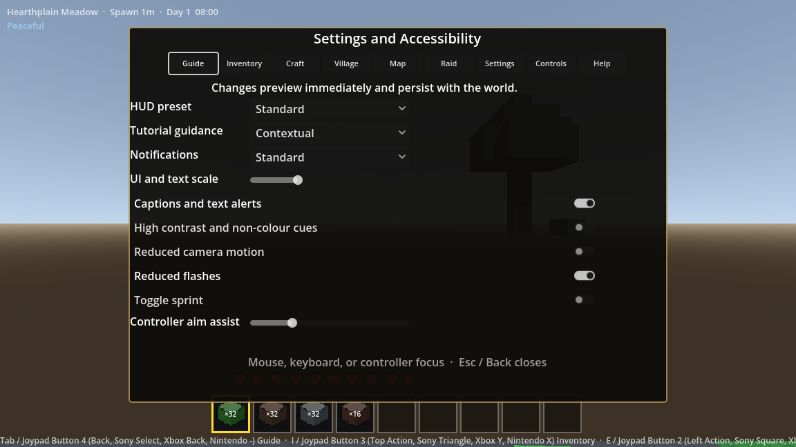

# Leyforge POC Manual Testing Guide

Version: 0.3
Last updated: 28 July 2026
Current implementation target: Post-POC Feature Stage B - living Camp-to-City
settlements, safe construction, worldgen v5 / regional plan v4, and save v17.

## 1. Purpose and Maintenance Rule

This is the living manual acceptance guide for the Leyforge proof of concept.
It explains what has been implemented, how to reach it in the game, what to
observe, and what evidence to record when something is wrong.

From Stage 7 onward, every implementation phase must update this guide before
the phase is handed over for final manual testing. Automated probes remain
important, but they do not replace the visual, usability, and feel checks in
this document.

## 2. What the Current POC Contains

### Stage 1 - Voxel Editing Core

- Chunked voxel terrain, collision, streaming, and bounded mesh rebuilding.
- First-person WASD movement, mouse look, jumping, sprinting, swimming, slabs,
  stairs, block targeting, mining, placement, physical drops, and pickup.
- Nine-slot hotbar, backpack storage, 2x2 hand crafting, and atomic saves.

### Stage 2 - Controlled POC Valley

- Deterministic world seeds and a named, versioned valley plan.
- Guaranteed Forest Hamlet, warehouse, watchtower site, base site, river,
  cave, mana pocket, rune ruin, goblin camp, and raid approach.
- Connected roads/trails and multi-biome terrain.

### Stage 3 - Core Content and Crafting

- Separate stable block and item registries.
- Crude, stone, and iron tools with harvest level, speed, and durability.
- 2x2 and 3x3 shaped/shapeless crafting.
- Workbench, furnace, chest, iron/copper refining, slabs, stairs, shared
  material variation, and transactional outputs.

### Stage 4 - Persistent Forest Hamlet

- Eight named villagers with persistent identity, jobs, schedule, needs, home,
  work target, position, dialogue, and actor streaming.
- Warehouse, request board, reputation, permissions, exact deliveries, and
  staged watchtower construction by the builder.
- Villagers now use articulated humanoid models with head, torso, two arms,
  and two legs. Limbs swing while walking. Job tools appear in their hands and
  basic work, build, mine, chop, cast, guard, hurt, and attack poses are shown.

### Stage 5 - Resource-Conserving Automation

- Manual crank, Basic Mechanical Miner, item chutes, crates, furnace routing,
  warehouse hatches, persistent item batches, faults, cross-chunk connectors,
  audit records, and near/far simulation.
- Multiple simultaneous chute inputs now reserve furnace capacity correctly:
  coal enters the fuel lane, one compatible ore enters the processing lane,
  and an incompatible ore continues to storage.

### Stage 6 - Mana, Runes, and Wards

- Raw Mana Crystal to Mana Shard to Mana Dust resource chain.
- Rune Table, Basic Rune, Mana Furnace, Mana Battery, Mana Conduit, and Ward
  Lantern.
- Personal mana, Stone Sense, Spark Bolt, network faults, ward coverage,
  bounded simulation, and persistent ruin/broken-portal teaser.

### Stage 7 - Combat and Goblin Raid

- Player health, held-item melee attacks, Spark Bolt compatibility, enemy
  damage, guard combat, and humanoid goblin raider/brute/captain profiles.
- Persistent warning, assault, resolution, and aftermath phases.
- Raid preparation reads the watchtower, guard condition, warehouse food,
  lighting, and active ward coverage.
- Prepared Victory, Costly Victory, Partial Loss, and Village Defeat outcomes.
- Persistent injuries, theft, reputation effect, event history, damaged
  warehouse voxels, and transactional Oak Beam repairs.
- Player and goblin combat state survives save/load.
- Raids originate from the actual deterministic Goblin Camp 95-165 metres
  from Hearthplain. Camp strength, supplies, losses, and cleared state persist.
- The camp owns a visible cage-style spawner cube and an 11x5x11 authored
  spawn volume. Raiders, brute, and captain are created at four deterministic
  points inside that volume rather than in Hearthplain or on its outskirts.
- The spawner cube, its collision, and every camp goblin remain inactive until
  the relevant chunk's terrain mesh and collision have both been committed.
- A loaded active spawner attempts a local spawn at a random 6-12 second
  interval. It permits at most three of its own ambient goblins and at most
  six total nearby goblins, including active raid goblins.
- The spawner is targetable like a voxel: point at the cage, hold LMB for
  1.6 seconds to break it, or use RMB to inspect its local/nearby counts.
  Breaking it clears its local ambient goblins, persists the cleared camp,
  and prevents that camp from starting another raid.
- Authored structure/camp volumes and future random world ecology are separate
  spawn channels. Adding a camp spawner does not replace roaming/random mobs.

### Stage 8 - End-to-End UI and Learning

- The open-world HUD now prioritises readable location/time, health, contextual
  mana, raid state, a tracked objective, and plain-language action feedback
  without exposing seed, coordinates, FPS, or other debug instructions.
- The tracked guide derives its next step from authoritative gathering,
  crafting, village, project, automation, magic, raid, damage, and repair
  state. Each step includes both an action and a cause-and-effect explanation.
- Shared Guide, Inventory, Craft, Village, Map, Raid, Pause, Settings,
  Controls, and Help routes use predictable focus and back behaviour.
- Inventory includes search/filter-lite, stack quantities, saved item
  durability, stable identity details, and controller-focusable slots.
- Crafting shows known versus hinted/undiscovered recipe counts, explains
  unmatched grids without consuming them, and supports bounded batch crafting.
- Village and request views connect reputation, permission reasons, physical
  warehouse stock, project reserves, worker/location, stage effects,
  shortages, and recent automation contribution.
- Machine inspection retains its authoritative status/fault/action panel and
  adds an optional non-colour flow/port/destination overlay.
- The local map reveals only learned landmarks and routes, distinguishes the
  player, tracked goal, and custom pin by shape and label, and persists its
  discovery/pin state.
- Raid readiness shows tower, guard, food, lighting, ward, approach,
  confidence, and pressure. Aftermath explicitly separates cause,
  consequences, and follow-up repair.
- UI/text scale, captions, high contrast, reduced motion, reduced flashes,
  toggle sprint, controller aim assist, HUD/tutorial/notification presets, and
  keyboard/controller rebinding preview immediately and persist in the global
  player profile.
- Controller defaults cover analogue movement/look, jump, sprint, primary use,
  interact, crafting, inventory, guide, map, village, item/skill-bar switching,
  slot cycling, focus navigation, and back.
- Help contains replayable system tutorials. Mana HUD elements remain hidden
  until the player learns basic magic.

### Stage 9 - Hardening and POC Release Candidate

- Version-13 saves add SHA-256 payload integrity, a build/save manifest,
  bounded save validation, atomic rotation, and final/previous/backup/temp
  recovery with a readable health report.
- Performance, Balanced, and Quality profiles adjust chunk, NPC,
  automation-visual, and magic-visual budgets without changing authoritative
  transactions or simulation state.
- Local release diagnostics include build/content identity, hardware class,
  bounded frame data, and system counters. They omit names, free-form text,
  file-system paths, remote upload, and unnecessary personal data.
- An interrupted process leaves a clean-session marker. The next launch writes
  a local unclean-session report; a normal exit removes the marker.
- The Pause menu can write a release report on demand. The Settings screen
  exposes the persisted performance profile and remains scrollable at 150
  percent UI scale.
- The Windows x86_64 export preset includes the verification-locked runtime
  registry mirror and supports the deterministic packaged traversal benchmark.
- Automated Stage 9 coverage includes recovery/migration fixtures,
  automation conservation regression, NPC promotion/demotion soak,
  controller/accessibility/localisation readiness, and official package
  execution.

### Post-POC Feature Stage A - Regional Multi-World Generation

- The project starts at a keyboard, mouse, and controller-focusable main menu.
  Continue opens the latest playable world; Worlds keeps incompatible or
  unrecoverable cards visible without allowing them to be overwritten.
- Each world has an isolated directory under `user://worlds/<world_id>/` with
  metadata plus final, previous, backup, and temporary save candidates.
- On first launch, the old single save and its recovery candidates are copied,
  never moved or deleted, into a card named **Legacy World**. That world stays
  on worldgen v2 / ValleyPlan v1.
- New worlds use save v16, worldgen v4, and regional plan v3. A blank seed creates
  a new unused positive 31-bit seed; signed numbers are accepted directly;
  case-sensitive UTF-8 text is deterministically hashed after trimming.
- New-world sites are derived from the seed, structure type, and signed
  structure-region coordinates. Hamlets, camps, ruins, cave entrances, mana
  pockets, and major resource fields continue across positive and negative
  chunks with type-specific spacing and hard minimum separation.
- The testing default is `nearby_discovery`: wilderness spawn plus independently
  sampled base, water, cave, hamlet, ruin, mana, resource, camp, raid, ecology,
  biome, and road relationships. The manifest preserves this starter mode so a
  later default can use `pure_wilderness` without changing existing worlds.
- Each discovered or streamed hamlet becomes an ID-scoped settlement with its
  own NPC namespace, warehouse, requests, projects, reputation, combat, linked
  camps, simulation time, and persistence. Unvisited sites remain derivable.
- A seed that fails its starter contract is blocked with the exact resolved seed
  and structured validation reasons. Worldgen v4 has no historical-layout
  fallback.
- Settings, accessibility, performance profile, notifications, and bindings
  live in an atomic backed-up `user://profile.json`. Tutorials, discoveries,
  map pins, inventory, settlement, combat, magic, and progression stay inside
  their world.
- Pause now offers **Save and Return to Main Menu**. Gameplay only closes after
  both the atomic world save and world-card metadata update succeed.

### Post-POC Feature Stage B - Living Settlements and Safe Construction

- Only newly created worlds use worldgen v5 / regional plan v4. Generated
  settlement sites retain the compatible `hamlet` site type but materialise as
  three-adult Camps with two connected tents, four reachable beds, a campfire,
  supply yard, request point, and route graph. Worldgen v2-v4 saves keep their
  original algorithms, coordinates, plan identities, and structures.
- Save v17 persists residents, households, ages, beds, jobs, personal
  inventories, carried stacks, equipment, tasks, transaction histories,
  surveys, routes, work packages, parcel claims, edit provenance, and logical
  door state. Existing save versions continue through the migration chain
  without retroactive excavation or terrain regeneration.
- Residents use the settlement route graph for long travel and a bounded local
  voxel path for final approach. They step or visibly jump one-block rises,
  avoid water, pits, two-block walls, unloaded terrain, and unsafe falls, and
  return to their last safe route node after persistent path failure.
- Directional player placement applies a 180-degree yaw around world Y so the
  front of a placed object faces the player. Blueprint door tokens compile to
  two-block doors with facing, hinge, collision, open state, actor access, and
  save/reload behaviour shared by both halves.
- Every new project begins with a deterministic terrain survey. The survey
  exposes clearance, rotation, base elevation, cut/fill, vegetation, water or
  support mode, collisions, protected player edits, route, tool tiers,
  expected drops, validation reasons, and stable hashes before construction.
- Construction is compiled into route, clearing, excavation/foundation,
  authored blueprint, and validation work packages. Workers reserve stock,
  travel to storage, carry tools and materials, work at a loaded reachable
  parcel, collect excavation drops, and deposit outputs. No progress or
  resources are consumed while a route, door, tool, stock, inventory, terrain,
  or loaded-chunk requirement is invalid.
- Crude, stone, and the existing canonical iron shovel form a shared excavation
  ladder. Shovels work soil-like blocks, pickaxes work stone and ore, and axes
  remove logs and leaves with shared level, durability, speed, and drop rules.
- Population is evaluated deterministically from functional reachable beds,
  adult job markers, provisions, safety, and needs. Migration, household
  formation, 14-day gestation, child age bands, three-day settlement migration
  cooldown, and 60-day adulthood are visible and persisted. Every resident has
  a stable residence and bed; damaged housing displaces residents and blocks
  growth.
- The project interface exposes every one of the 120 catalogue projects and 13
  plans with exact blockers. Required next-stage projects appear before
  promotion, and completion of the watchtower immediately recalculates
  housing, jobs, routes, safety, capability, and player-priority proposals.

### Current Visual Model Pass

- The player uses one persistent instance of the same articulated humanoid rig
  as villagers for its complete world/future third-person presentation.
- The head mesh is attached to a real head anchor and the first-person camera
  sits exactly on that anchor's rotation pivot. Mouse look therefore rotates
  in place rather than orbiting around an offset behind the torso.
- First person now renders the same connected player body used for the future
  third-person view. Only the player's own head is hidden from its camera;
  looking down reveals the attached torso, shoulder/arm joins, hands, and
  legs, while a normal forward view keeps the body below the screen edge.
- Arms pivot from the left and right torso edges instead of floating beside
  them. Every tool is authored bottom-to-working-end along the same local
  direction. Held tools/items then share an X +90 degree, Y +180 degree
  (reversed-Y) rotation, with the canonical bottom placed exactly at the
  centre of the hand rather than corrected by individual visual offsets.
- The directly runnable Visual Test Room presents player, villager, and goblin
  reference rigs in T-pose, a T-pose hand-grip example for every current visual
  kind, all 143 registered block models, and all 167 registered item models.
- Pickaxes, axes, hammers, swords, staffs, crystals, runes, ingots, food, and
  blocks have distinct low-poly held/drop silhouettes.
- Furnace, Mana Furnace, chest/crate, item chute, door, workbench/rune table,
  torch/ward-style posts, and glass have authored voxel silhouettes.
- Glass is translucent and remains collidable.
- Water uses its own depth-stable transparent surface rather than sharing
  glass rendering.
- Dry riverbed gravel now uses a neutral grey terrain palette instead of the
  registry's teal placeholder, so it cannot be mistaken for water.
- Directional blocks retain their facing. Stairs, doors, furnaces, chests,
  workstations, posts, and chutes use the direction faced during placement.
- A door is one inventory object assembled from two 32x32 voxel cells into a
  32x64, two-block-tall placed model.
- Chutes visually auto-connect to multiple horizontal inputs and relevant
  automation endpoints. Straight, corner, T, and cross pieces share aligned
  centres and rails. Corner and T centres add retaining walls on every side
  without a connection; their simulation accepts inputs from all six faces.
- Oak Door handles sit high on the lower half and appear on both faces.
- The item hotbar and nine-slot skill bar share one HUD position. Q swaps
  between them, 1-9 chooses the active slot, and LMB uses the selected item or
  skill. K assigns unlocked skills to skill-bar slots.
- Health uses hearts and mana uses ten blue diamond pips that visibly empty
  and refill.
- Inventory thumbnails distinguish priority functional-block shapes.
- Held, placed, dropped, and HUD visuals share a 32x32 source-grid contract.

These are intentionally low-poly POC models. They establish identity,
animation hooks, proportions, and readability without locking the project to a
final art style or external asset pack.

## 3. Starting a Test

1. Open `D:\AI\Projects\leyforge` in Summer.
2. Select the scene required for the current test in Summer. Use
   `res://main_menu.tscn` for menu/world lifecycle testing,
   `res://main.tscn` for the gameplay-owned POC scene, or a directly runnable
   development scene such as the Village Progression Lab. The development
   startup selection is intentionally swappable and is not pinned by a gate.
3. Use **Continue** for the latest playable world, **Worlds** to inspect every
   card, or **New World** to create a regional world.
4. Enter a world name. Leave Seed blank for a random seed, press **Reroll** to
   preview another one, or enter a signed number or case-sensitive text.
5. Confirm the resolved seed, regional plan ID, and validation result, then choose
   **Create and Load World**. Wait for the world and HUD before moving.

### Opening the Visual Test Room

The Visual Test Room is a directly runnable development scene; it does not
replace or modify the normal game save.

1. In Summer's **FileSystem** panel, expand `.summer`, then `verification`.
2. Double-click `visual_test_room.tscn`.
3. Press **F6** or click **Play Current Scene**.
4. Stop that scene when finished. Press **F5** to run the normal
   `main.tscn` game again.

F6 remains the quickest scene-only test. Summer's startup-scene switch may also
be used when its integrated runner needs a scene selected as the project
target; remember to choose the desired menu or gameplay scene for that test.

### Opening the Village Progression Lab

The progression lab is a separate editor/F6 scene. It never selects a normal
world and stores optional snapshots only below
`user://development/village_progression_lab/`.

1. Open `res://development/village_progression_lab.tscn`.
2. Press **F6**. The lab starts beside the selected settlement in first-person
   exploration mode. Confirm **WASD**, mouse look, jump, and sprint work, then
   walk far enough to see voxel chunks stream around the production player.
   Confirm the normal HUD, hotbar, inventory, full humanoid, raid runtime, and
   three labelled, equipped, moving founding resident actors are present.
3. Press **F1** to open the diagnostic panel. Movement locks and the mouse is
   released while the panel is open. Press **F1** or **Escape** to return to
   exploration. With the diagnostic panel closed, **Escape** retains its
   normal pause-screen behaviour.
4. Follow the persistent **TEST QUEST** overlay. In diagnostics, use
   **Verify Objective** after completing its automatic requirements and
   **Mark Visual Check** after completing the requested inspection. Previous
   and Next browse the guide without falsely marking an objective complete.
5. Use **Travel To Selected** or **Return To Lab Center** when moving quickly
   between the two plots. These controls also move the chunk-streaming focus.
6. Switch Settlement between the two stable IDs and confirm warehouse,
   residents, projects, reputation, buildings, plans, and history remain
   isolated. Each plot must promote its own namespaced residents; no
   actor from the other settlement may remain.
7. Select each deliberate **Flat**, **Wooded**, **Steep**, **Water Edge**, and
   **Player Obstructed** parcel. Rotate through four yaws, inspect the real
   survey, route, clearance, cut/fill, vegetation, tool/drop, and collision
   records, and verify that player overlap requires a separate confirmation.
8. Test every capability preset from Camp through Magical Metropolis. Projects
   must use the real survey, route, excavation, inventory, population, door,
   project, and serializer interfaces. Also run watchtower compatibility,
   cottage/growth, full capability ladder, and damaged megaproject presets.
9. Select projects and use exact or chosen-resource grants, reserve, advance one
   block or stage, finish, cancel, damage, repair, and activation controls.
   Watch the worker travel to storage and the parcel, carry stock and tools,
   deposit excavation drops, and place real blueprint voxels. Press **C** while
   exploring to use the complete creative catalogue.
10. Select a district, complex, or megaproject. Reserve and advance components,
   then inspect prerequisite, reservation, activation, damage, repair, and
   history records.
11. Force migration, household formation, birth, age advancement, job
   assignment, eviction, and re-housing. Confirm every resident retains a
   reachable residence/bed, personal inventory, equipment, and transaction
   history, and that children never occupy adult jobs.
12. Switch near/far simulation, advance 60 minutes, and inspect the transaction
   result, services, needs, jobs, storage, residents, and capability gates.
13. Save the lab snapshot, change both plots, reload, and confirm the saved
   records and voxel edits return without creating or changing a world card.
   The active quest and completed milestones must also return.
14. Use Reset Lab and confirm both isolated plots and the quest guide return to
   their initial state.

The built-in Camp-to-Magical-Metropolis certification quest covers these 31
objectives in order:

1. Meet and interact with the three founding residents.
2. Inspect the camp foundation, jobs, needs, supplies, and capability gate.
3. Equip the real player through the complete creative catalogue.
4. Survey the five construction parcels and confirm protected overlap.
5. Build a traversable access route and complete cut/fill or excavation.
6. Verify tool tiers, personal inventories, hauling, durability, and deposits.
7. Admit the first migrant through spare-bed and suitable-job gates.
8. Build permanent housing, test displacement/re-housing, and promote.
9. Open, close, traverse, obstruct, and reload a logical two-block door.
10. Form a household, begin a birth, and advance every child age band.
11. Complete the watchtower and confirm new proposals immediately continue.
12. Stock and inspect settlement storage, requests, and reservations.
13. Grow and visually inspect the Hamlet.
14. Create, supply, survey, place, and reserve a construction project.
15. Perform route, terrain, and authored voxel work through real tasks.
16. Cancel a project and inspect resource, claim, and history recovery.
17. Grow and inspect the Village service set.
18. Damage, repair, deactivate, and reactivate a building.
19. Grow and inspect the Fortified Village defence set.
20. Operate a Town in near simulation and inspect conserved transactions.
21. Run the same settlement in deterministic far simulation.
22. Run the automation production and delivery loop.
23. Run the mana production, network, and ward loop.
24. Build and walk the full City service and district set.
25. Grow and inspect Capital governance and high-tier services.
26. Create, reserve, and advance a district, complex, or megaproject plan.
27. Damage and restore a plan component and inspect partial activation.
28. Launch, fight, resolve, and inspect a real settlement raid.
29. Visit the second settlement and prove all runtime state is isolated.
30. Save, mutate, and reload the isolated lab snapshot.
31. Load the Magical Metropolis and damaged-megaproject presets, inspect the
    complete capability ladder, and record remaining defects.

The Windows world root is normally under:

`%APPDATA%\Godot\app_userdata\Leyforge\worlds\`

The legacy single save remains at
`%APPDATA%\Godot\app_userdata\Leyforge\leyforge_save.json`; first-launch import
copies it and its recovery files without deleting them. Global settings are in
`profile.json`. Do not manually alter these files during a normal playtest.

## 4. Controls

| Control | Action |
|---|---|
| W, A, S, D | Move |
| Mouse | Look |
| Space | Jump or swim upward |
| Shift | Sprint |
| Left Mouse (item bar) | Attack a targeted NPC/enemy with the held item |
| Left Mouse (hold on voxel, item bar) | Mine the targeted voxel |
| Left Mouse (hold on camp spawner) | Break the targeted spawner |
| Left Mouse (skill bar) | Use the selected learned skill/action |
| Right Mouse | Place selected block or interact |
| F | Secondary keyboard attack |
| Q | Swap between the item hotbar and skill bar |
| K | Open/close skill assignment |
| E | Open/close 2x2 hand crafting |
| C | Open/close creative testing catalogue |
| 1-9 | Select a slot on the active item/skill bar |
| Mouse wheel | Cycle the active item/skill bar |
| F1 (Village Progression Lab) | Toggle diagnostic controls/exploration |
| Tab | Open/close the current Guide |
| I | Open/close Inventory |
| M | Open/close the discovered local Map |
| V | Open/close the Village overview |
| [ and ] | Previous/next item or skill slot |
| Escape | Close UI; from play, open Pause and Session |

Default controller bindings:

| Control | Action |
|---|---|
| Left Stick / Right Stick | Move / look |
| A / Left Stick Click | Jump / sprint |
| Right Trigger / Left Trigger | Primary use / interact or place |
| Y / X | Inventory / crafting |
| Back | Guide |
| D-pad Up / Down | Map / Village |
| D-pad Left / Right | Previous / next item or skill slot |
| Left Shoulder | Swap item and skill bars |
| B | Back/close focused UI |

## 5. Fast Smoke Test

Run this after every new build before a longer playtest.

1. Confirm the world loads and the HUD shows biome, landmark, time, visual
   hearts, the item bar, current guide step, and relevant raid state. Mana
   diamonds must remain hidden until basic magic is learned. Seed,
   coordinates, and FPS must not appear in the normal HUD.
2. Walk, sprint, jump, look around, and mine one dirt or grass block.
3. Walk over the physical drop and confirm it enters the inventory.
4. Select an empty hotbar slot and confirm a first-person arm is visible. Look
   down and confirm the arm joins the torso and the body/legs belong to the
   same rig; the player's own head must not block the camera.
5. Select a block and a pickaxe and confirm each appears in the hand.
6. Find a villager and confirm head, torso, arms, and legs are all present.
7. Watch a villager walk and confirm opposite arms/legs swing.
8. Open and close hand crafting with E.
9. Open the creative catalogue with C and close it with C or Escape.
10. Confirm there are no magenta missing-content blocks or frozen controls.
11. Press Q and confirm the item bar changes to a nine-slot skill bar. Use
    1-9 to change its selected slot, then press K and confirm learned skills
    can be assigned to any of those slots.
12. Open Guide, Inventory, Village, Map, Raid, Settings, Controls, and Help.
    Confirm Escape returns through each screen and no panel traps focus.
13. Repeat menu navigation with a controller or keyboard only. Confirm every
    screen establishes a visible focus target and can be closed without using
    the mouse.

## 6. Visual Model Acceptance

### 6.1 Villagers

Test at least the builder, guard, miner, lumberjack, and mage.

- [ ] Each has a head, torso, two separate arms, and two separate legs.
- [ ] The face direction is readable from the eyes.
- [ ] Arms and legs move in opposite pairs while walking.
- [ ] Limbs return to a stable idle pose without vibrating.
- [ ] The builder holds a hammer and swings while building.
- [ ] The miner holds a pickaxe and shows a mining pose at work.
- [ ] The lumberjack holds an axe and shows a chopping pose at work.
- [ ] The mage holds a staff and shows a basic casting pose at work.
- [ ] The guard holds a sword and attacks goblins during a raid.
- [ ] Name/job labels remain legible and do not hide the body.

### 6.2 Player and First-Person Hand

- [ ] With an empty selected slot, the connected right arm remains visible at
      the lower screen edge without a duplicate camera-only arm.
- [ ] Slowly move through the full vertical and horizontal look range. The
      camera rotates from one fixed eye point and does not arc/orbit around the
      torso.
- [ ] Looking down shows the connected torso and legs; the own-player head
      remains hidden so it cannot surround or clip through the camera.
- [ ] Both arms meet the left/right torso edges at the shoulders with no gap
      or overlap in the Visual Test Room T-pose.
- [ ] A selected block appears as a small block model in the hand.
- [ ] A pickaxe has a handle and horizontal pick head.
- [ ] An axe, hammer, sword, staff, rune/crystal, and ingot are visually
      distinguishable.
- [ ] Mining swings the hand repeatedly.
- [ ] Placement, spell casting, and F attacks produce a basic swing/action.
- [ ] Q swaps the shared item/skill bar position without leaving both bars
      stacked on screen.
- [ ] With the skill bar active, 1-9 selects a skill and LMB uses it; an empty
      slot reports that it is empty without mining the targeted block.
- [ ] LMB attacks a goblin/NPC combat target but mines a voxel when the
      crosshair is on terrain.
- [ ] The action is quick and clearly larger than the idle/walk arm motion.
- [ ] The first-person item does not cover the crosshair or most of the screen.
- [ ] The arm comes from the lower-right view, the hand meets the item grip,
      and the landscape remains unobstructed.
- [ ] The bottom of every held tool/item meets the centre of the hand without
      a gap or passing through the palm.
- [ ] Pickaxe, axe, hammer, sword, spear, staff, bow, and generic tools all
      use the same X +90/Y +180 hand rotation and point in the direction the
      character faces instead of lying diagonally along the arm.
- [ ] An outside observer sees the complete attached head and body; the
      first-person camera hides only its own head.
- [ ] Looking around rotates the camera through the player head anchor rather
      than orbiting around, or moving a detached body in front of, the camera.

### 6.3 Functional Blocks

Use C to grant the following blocks, place them in daylight, and walk around
all sides.

- [ ] Stone Furnace has a raised stone shell and dark front firebox.
- [ ] Mana Furnace uses the same furnace silhouette with its magic colour.
- [ ] Wooden Chest/Crate has a lower body, raised lid, and front latch.
- [ ] Basic Item Chute reads as an open transport trough, not a solid cube.
- [ ] Oak Door places two blocks tall from one item, with a high handle on
      both front and back faces.
- [ ] Workbench/Rune Table has a raised work surface and legs.
- [ ] Torch/Ward-style blocks use a narrow post silhouette.
- [ ] Glass Window is translucent; terrain and actors can be seen through it.
- [ ] Glass still blocks movement and can be mined.
- [ ] Inventory thumbnails distinguish furnace, chest, chute, and door.
- [ ] Water is readable and translucent without glass-like overlapping faces,
      dark planes, or flickering patches.
- [ ] Dry gravel beside/above a river is neutral grey and visually distinct
      from the transparent blue water surface.

Record any block whose silhouette is ambiguous, clips into neighbours, has
incorrect collision, or exposes invisible faces.

Reference render:


### 6.4 First-Person Reference

The expected held-pickaxe composition uses the complete connected owner rig,
hides only its head, and keeps the crosshair and most of the hotbar
unobstructed while leaving the arm and tool readable:


The matching skill-bar composition hides the held inventory item, retains the
player's right hand, shows nine assignable slots, and marks the selection:



The outside reference proves that this same owner rig contains its attached
head, torso, arms, legs, hand, and held model:



### 6.5 Visual Test Room

Open and run:

`res://.summer/verification/visual_test_room.tscn`

This scene is a model-review workspace and does not alter the normal game or
save. It loads:

- player, villager, and goblin reference bodies in a stable T-pose;
- one T-pose hand-grip example for each distinct held-model kind;
- every registered block model after the blue floor line; and
- every registered item model after the orange floor line.

Controls:

| Control | Test Room Action |
|---|---|
| W, A, S, D | Fly horizontally |
| Mouse | Look from the fixed inspection camera |
| E / C | Rise / descend |
| Shift | Fast fly |
| Escape | Release mouse |
| Left Mouse | Capture mouse again |

For each rig, inspect the shoulder joins, head/torso join, hand position,
silhouette, forward direction, and item grip from the front, side, and back.
For each catalogue pedestal, record any generic sphere/cube that needs a
specific authored model, incorrect scale/orientation, unclear front face,
missing transparency, or HUD/world mismatch. The room is intentionally the
ongoing visual punch-list workspace; a model appearing here does not mean its
art is considered final.

Reference overview:



## 7. Stage-by-Stage Manual Tests

### 7.1 Terrain, Movement, and Persistence

1. Travel across grass, sand, snow, water, a slab, and a stair.
2. Mine and place at least five blocks across a chunk boundary.
3. Exit normally and reopen the game.
4. Confirm position, view direction, inventory, edits, drops, and functional
   block contents are restored.

Expected: no falling through terrain, invisible walls, duplicated drops, or
lost edits.

### 7.2 Crafting and Furnace

1. Craft Oak Planks and Sticks by hand.
2. Use a Workbench for a 3x3 tool or station recipe.
3. Put coal in furnace fuel and raw ore in input.
4. Confirm progress pauses if output is blocked.
5. Remove the output and confirm exact input/fuel counts.

### 7.3 Concurrent Furnace Routing Regression

Build one connected chute network ending in a Stone Furnace and a storage
crate. Feed one Iron Ore, one Coal, and one Copper Ore into the network close
together.

Expected:

- Coal reserves and reaches the furnace fuel slot.
- The first compatible ore reserves and reaches a furnace input.
- The other incompatible ore does not enter another empty furnace input.
- That ore continues through the chute network into storage.
- No item duplicates or disappears.

Repeat with copper arriving before iron; copper should become the active
furnace recipe and iron should continue to storage.

### 7.4 Forest Hamlet and Watchtower

1. Follow the road to the hamlet and speak to Elder Rowan.
2. Open the request board and deliver the current stage only.
3. Confirm reputation/permissions change at their documented thresholds.
4. Watch Talia place watchtower voxels one at a time.
5. Save/reload during construction and confirm the stage resumes.
6. Complete all four stages and confirm the project remains at 100%.

### 7.5 Automation

1. Place a Manual Crank beside a Basic Mechanical Miner.
2. Connect miner, chute, furnace or crate, and optionally a warehouse hatch.
3. Charge the crank and inspect the miner.
4. Lock an ore family with the Basic Wrench.
5. Confirm blocked/full/permission faults are readable.
6. Save while a batch is moving and reload.

Expected: exact quantities survive every transfer, blockage, and reload.

### 7.6 Mana, Runes, and Wards

1. Speak with Serin after helping the hamlet to learn POC magic.
2. Refine Raw Mana Crystal into Shards and Dust.
3. Craft a Rune Table and the Basic Rune components.
4. Connect a Mana Battery, conduits, Mana Furnace, and Ward Lantern.
5. Charge the battery and inspect network IDs/faults.
6. Run a Mana Furnace recipe and confirm exact mana is consumed on commit.
7. Stand near an active Ward Lantern and confirm coverage feedback.
8. Press Q to open the skill bar, select Stone Sense or Spark Bolt with 1-9,
   and use the selected spell with LMB.
9. Visit the rune ruin and inspect the broken portal teaser.

The first two spells are assigned to skill slots 1 and 2 automatically when
first learned. Use K to move them to any of the nine slots and verify the
assignments, selected slot, and active item/skill bar survive save/reload.

### 7.7 Combat and Goblin Raid

1. Speak to militia guard Elric Vale.
2. Select **Sound the Stage 7 raid warning**.
3. Confirm the HUD shows an eight-second warning before assault.
4. Watch non-combatants move toward shelter and Elric intercept goblins.
5. Confirm raiders, brute, and captain have humanoid silhouettes and weapons.
6. Fight with LMB on the item bar. Press Q and select Spark Bolt if it is
   assigned, then cast it with LMB. Confirm hearts, enemy count, and mana
   diamonds change.
7. Let the raid resolve or defeat all enemies.
8. Read the outcome and remaining repair count in the HUD/guard dialogue.
9. Inspect the warehouse perimeter for missing/damaged voxels after a
   non-perfect outcome.
10. Put Oak Beams in player inventory, speak to Elric, and select the repair
    action once per damaged voxel.
11. Confirm each repair consumes exactly one beam and restores the voxel.
12. Save/reload during warning, assault, and aftermath in separate runs.

Expected outcome influences:

| Preparation | Expected tendency |
|---|---|
| No tower, injured/unready guard, little food, no ward | Partial Loss or Village Defeat |
| Partial tower, ready guard, some food | Costly Victory or Partial Loss |
| Complete tower, ready guard, stocked food, active ward | Prepared Victory |

The automated Stage 7 acceptance probe separately forces at least three
preparation matrices to prove deterministic graded outcomes.

### 7.8 Stabilization and Directional Placement

#### Ability and Vital HUD

1. Learn magic from Serin or the rune ruin.
2. Press Q and confirm the nine item slots are replaced by nine skill slots in
   the same screen position.
3. Use 1-9 and the mouse wheel on each bar; confirm they select only that
   bar's current slot.
4. Press K, select any of the nine slots, then assign Stone Sense or Spark
   Bolt.
5. Close assignment, select the spell on the skill bar, and use LMB.
6. Cast until mana diamonds visibly empty, then wait and watch them refill.
7. Press Q to return to items and confirm LMB attacks or mines again.
8. Let a goblin hit the player and confirm filled hearts become empty hearts.
9. Save/reload and confirm assignments, selected skill slot, active bar,
   current mana, and health persist.

#### Door and Facing

1. Face north, east, south, and west and place an Oak Stair at each direction.
2. Repeat with furnaces, chests, workstations, and chutes.
3. Confirm front details and stair rises follow the placement direction.
4. Place one Oak Door with two clear cells above the ground.
5. Confirm it consumes one item but occupies two cells and is two blocks tall.
6. Confirm its handle is above the midpoint of the lower block and appears on
   both sides.
7. Mine either half. Confirm both halves disappear and exactly one door drops.
8. Save/reload placed directional blocks and verify no block returns north.

#### Chute Auto-Connection and Multiple Inputs

1. Place and inspect one north-south and one east-west straight chute.
2. Place an L corner and confirm both trough floors and side rails meet at one
   aligned centre without gaps or overlapping walls. Confirm both sides
   without a connection have retaining walls.
3. Place one centre chute and add chutes from north, east, and south.
4. Confirm the centre model becomes a clean three-way junction and the one
   unconnected side has a retaining wall.
5. Add the west branch and confirm the cross junction retains one square
   centre with four aligned branches.
6. Replace one branch with a furnace or crate and confirm the arm still joins.
7. Feed batches from at least two branches at nearly the same time.
8. Confirm each batch is conserved and routes according to endpoint capacity.

Reference corner, T, and cross render:



#### Villager and Raider Chunk-Ready Spawn

1. Start a fresh world and watch toward Hearthplain while terrain streams.
2. Approach the hamlet quickly.
3. Confirm villagers appear only after their ground mesh/collision exists.
4. Approach the Goblin Camp. Confirm its black cage/green-core spawner cube
   does not appear before the camp terrain mesh/collision, then becomes visible
   and solid once that chunk is ready.
5. Sound a raid and return to or observe the camp. Confirm the four goblins
   originate around that cube inside the camp, not inside Hearthplain.
6. Confirm raiders are not promoted to actors until their camp spawn columns,
   ground, feet space, and headroom exist.
7. Confirm no villager or raider floats, falls through empty sky, or snaps
   down from a temporarily missing chunk.

#### Goblin Camp Source

1. Find the named Goblin Camp before starting a raid and note its direction.
2. Return to Elric and sound the warning.
3. Confirm the message reports that camp as the source and its distance.
4. Find the visible cage-style spawner at the camp and confirm all four raid
   records initially appear within its local spawn region.
5. Confirm none of the goblins initially appear beside villagers, the
   warehouse, watchtower, or Hearthplain paths.
6. Without a raid running, remain near the loaded spawner for at least
   30 seconds. Confirm ambient goblins arrive in small random intervals, stop
   at three local goblins, and never make the nearby total exceed six.
7. Point the crosshair at the cage. Confirm the voxel highlight surrounds it,
   use RMB to read its counts, then hold LMB for about 1.6 seconds.
8. Confirm the cage disappears, its local ambient goblins clear, and the camp
   is recorded as cleared. Save/reload and confirm the cage stays broken.
9. Return to Elric and confirm the destroyed camp spawner cannot launch
   another raid.

Reference camp-owned spawn render:



### 7.9 End-to-End UI, Learning, Input, and Accessibility

#### Connected First-Time Guide

1. Start a fresh world with **Tutorial guidance: Guided**.
2. Confirm the first tracked step teaches gathering and explains that physical
   drops preserve resources when inventory is full.
3. Gather a resource, craft a real recipe, meet Elder Maelin, and inspect the
   request board. Confirm the guide advances from gathering to crafting to
   village supply using completed gameplay state rather than a separate
   checklist.
4. Complete or load each later checkpoint: watchtower supply/building,
   automation warehouse delivery, basic magic, raid warning/assault,
   aftermath, and repair.
5. At every checkpoint, open **Guide** and confirm it states what to do and why
   that action changes the next system. It must not require a debug command,
   coordinate, stable ID, or developer explanation.

Reference guide:



#### Inventory, Crafting, Village, and Machines

1. Open Inventory and search by a visible item name. Confirm results identify
   stack quantity, hotbar/backpack location, category, and durability for
   distinct tools.
2. In crafting, place a valid multi-craft set of ingredients, choose a batch
   quantity, and craft. Confirm only craftable batches complete and all
   remaining ingredients stay in the grid.
3. Place an unmatched grid. Confirm the UI says it is unmatched and consumes
   nothing.
4. Open Village and confirm reputation, population, injuries, shortages,
   watchtower stage, permissions with `[OPEN]`/`[LOCKED]` text, and recent
   automation contribution are readable without colour.
5. Open the request board and warehouse. Confirm the stage reward/effect,
   worker/location, physical stock, project reserve, permissions, and delivery
   route agree with authoritative state.
6. Inspect a miner, chute, furnace, crate, and warehouse hatch. Toggle the flow
   overlay and confirm status, direction/ports, blockage, and destination agree
   with the world and machine panel.

#### Map and Knowledge Reveal

1. Open Map near spawn. Confirm only discovered landmarks and routes appear.
2. Approach the hamlet, cave, rune ruin, and goblin route; reopen Map after
   each discovery and confirm the new labelled marker appears.
3. Click the map or activate it with controller focus to create a custom pin.
   Confirm the player triangle, tracked-goal ring, and custom pin remain
   distinguishable without colour.
4. Save/reload and confirm discovered landmarks and the custom pin persist.
5. Before magic is learned, confirm mana diamonds and advanced magic guidance
   are absent. Learn basic magic and confirm the mana HUD, spell assignment,
   rune guidance, and rune/mana landmarks reveal.

Reference local map:



#### Raid Readiness and Aftermath Explanation

1. Open Raid before sounding the warning. Confirm watchtower stages, guard,
   food, lighting, ward, route, confidence, readiness score, and camp pressure
   show explicit `[READY]` or `[MISSING]` cues.
2. Change one preparation input and reopen Raid. Confirm the score and its
   labelled input change together.
3. Sound the warning and confirm the adaptive HUD promotes countdown,
   direction, enemy count, and civilian/guard danger.
4. Resolve a raid and open Raid again. Confirm **Cause**, **Consequences**, and
   **Follow-up** identify preparation versus pressure, enemy defeats, injuries,
   stolen resources, structure damage, reputation, and exact Oak Beam repair.
5. Save/reload in warning, assault, and aftermath. Confirm the visible
   summaries match the restored authoritative state.

#### Settings, Rebinding, Controller, and Recovery

1. Open Settings and change UI/text scale, HUD preset, tutorial guidance,
   captions, high contrast, reduced motion, reduced flashes, and toggle
   sprint. Change controller aim assist from its default. Confirm each setting
   previews immediately without changing gameplay truth.
2. Open Controls, activate a binding row, and press a new keyboard input.
   Confirm the controller binding remains. Repeat with a controller input and
   confirm the keyboard binding remains. Assign the same input to two actions
   and confirm both rows report the conflict.
3. Complete the fast smoke path with controller only: move/look, jump, gather,
   interact, craft, open inventory/guide/map/village, cycle the action bar, and
   navigate/close every screen.
4. Save, reload, and confirm settings and bindings persist.
5. In Pause, select **Save World**. Confirm the status says **Saving** then
   **World saved safely**. If saving is forced to fail in a verification copy,
   confirm the message states that the previous save is unchanged and tells
   the player to keep the session open and retry.

Reference accessibility settings:



#### Representative-Player Exit Gate

Give a representative first-time player the fresh POC without live developer
coaching. Record whether they can gather/craft, discover the village need,
deliver and understand project reserves, diagnose a production chain, reveal
mana and support a ward, prepare for and fight the raid, and understand the
aftermath. Before acceptance, ask them to explain:

- why the watchtower progressed;
- why a tested machine stopped and how they recovered it;
- why the warehouse accepted or rejected a supply;
- how tower, guard, food, lighting, ward, and combat changed the raid result;
- what was saved and what action remains after the aftermath.

The project owner confirmed the representative Stage 8 build working on
25 July 2026, satisfying the continuation gate for Stage 9. Keep this script as
the Stage 8 regression check for every later candidate.

### 7.10 Stage 9 Release-Candidate Sign-Off

Perform this final check against the exported Windows package, not the editor:

1. Start with a copy of a representative version-12 save. Confirm the package
   loads it, rewrites it as version 13 after saving, and retains inventory,
   village, project, automation, magic, raid, UI, map, and input state.
2. In a disposable verification profile only, corrupt a copied current save.
   Confirm the package rejects it, recovers the valid backup, and reports
   **Recovered** rather than silently loading the changed payload. Never
   corrupt the live player save.
3. Open Settings at 150 percent UI scale. Cycle Performance, Balanced, and
   Quality, scroll the complete settings page, and confirm keyboard and
   controller focus remain visible. Return to Balanced for the remaining test.
4. Play the connected loop long enough to visit the hamlet, an automation
   chain, the mana area, the raid approach, and the goblin camp. Confirm
   streaming or visual-distance changes do not pause, duplicate, or delete
   authoritative resources and do not change NPC identities.
5. Use controller only to move/look, interact, use the action bar, and
   navigate/close Guide, Inventory, Craft, Map, Village, Raid, Pause, Settings,
   Controls, and Help.
6. In Pause, select **Write Release Diagnostics**. Confirm the status reports
   success and that `leyforge_release_report.json` exists below the Leyforge
   Godot user-data directory. Inspect it for build, hardware, save-health, and
   performance sections; confirm it contains no player name, chat/free-form
   content, save path, or remote-upload identifier.
7. Close normally and relaunch. Confirm no false unclean-session report is
   produced. In a disposable profile, force-close once, relaunch, and confirm
   the local unclean-session report is produced without blocking play.
8. Run the packaged benchmark at 1920x1080 Balanced. Confirm it exits zero,
   loads 143 blocks and 167 items, records at least 900 samples, passes the
   16.67 ms p95 target or records an explicit target-hardware exception, and
   always stays within the 33.34 ms fallback release floor.

Record the package hashes, hardware, renderer, resolution, p95/max frame time,
save-health result, controller result, accessibility result, and any exception.
Stage 9 is manually accepted only when every blocker is cleared or an exception
is explicitly approved in the release-candidate record.

## 8. Save/Reload Checkpoints

Test these checkpoints independently:

- A physical item is on the ground.
- A furnace recipe is partway complete.
- An automation batch is in a chute.
- Watchtower construction is partway through a stage.
- A Mana Furnace is connected and powered.
- A ward is active.
- Raid warning is counting down.
- Goblins have taken damage during assault.
- Raid aftermath contains injuries, stolen stock, or damaged voxels.
- Some, but not all, damaged voxels have been repaired.
- The guide is on a later connected-loop step.
- Map landmarks and a custom pin have been discovered.
- UI/accessibility settings and at least one keyboard/controller binding have
  been changed.
- A version-12 representative save has migrated to integrity-protected
  version 13.
- A disposable corrupted final save has recovered from its valid backup.
- The selected Stage 9 performance profile has persisted.
- Two same-seed worlds retain different inventory, settlement, combat, map,
  and progression state while sharing the same accessibility and controls.
- Save v16 reload reproduces the resolved seed, regional plan/config hashes,
  generated/discovered sites, independent settlement records, voxel edits,
  system state, and per-world knowledge exactly.

After reload, inspect both visible state and quantities.

### 8.1 Regional Multi-World Smoke Test

1. On the main menu, change High Contrast, UI Scale, Performance Profile, and
   one disposable keyboard/controller binding. Return to the menu pages and
   confirm each change remains.
2. Create **Random A** with a blank seed. Record its starter mode, resolved seed,
   plan ID, site-plan hash, placement-rule hash, and regional config ID. Visit
   spawn, hamlet, warehouse/watchtower, base, water, cave, resource area, rune
   ruin, mana pocket, camp/spawner, and raid approach.
3. Confirm the spawn is safe and dry; critical sites are buildable; the cave
   is open; roads connect the required loop; resources are reachable; and no
   structures overlap.
4. Gather and craft, change inventory, discover a map landmark, advance one
   village request, interact with automation and magic, and begin or complete
   a raid. Save and return to the menu.
5. Travel far enough in Random A to discover a second generated hamlet and at
   least one non-starter camp, ruin, cave, mana pocket, and resource field.
   Confirm their positions and rotations do not repeat the starter constellation.
   Change the distant hamlet's warehouse, project, reputation, and raid state,
   then return to the first hamlet and confirm it is unchanged.
6. Cross both positive and negative chunk coordinates. Confirm sites continue
   to appear with valid spacing, terrain, IDs, variants, and no duplicated
   structure where a footprint crosses a chunk border.
7. Create **Random B** with a different blank seed. Confirm the layout visibly
   differs and none of Random A's inventory, map, settlement, combat, magic, or
   progression state appears. Confirm the global settings and binding do.
8. Create **Custom Numeric** with `-42` and **Custom Text** with
   `Leyforge Test`. Recreate each entry in a disposable profile and confirm its
   resolved seed and plan ID are identical.
9. Load Random A again. Confirm every edit and both settlement records return
   exactly. Repeat Save and Return to Main Menu.
10. Inspect **Worlds**. Confirm every card shows name, original/resolved seed,
   last played, playtime, save/worldgen/plan versions, profile, plan ID, and
   save health. An intentionally damaged disposable world must remain visible
   and disabled rather than starting fresh.
11. If a seed is blocked, record the exact seed and every validation reason.
   Never treat a fallback layout as an acceptable randomized-world result.

Automated development runs use
`current_worldgen_fast_probe.tscn` for 256 plans. Pass
`--worldgen-seeds=10000` after `--` for the extended suite.
`current_worldgen_runtime_probe.tscn` also proves chunk-border generation-order
identity. `regional_settlement_isolation_probe.tscn`,
`world_lifecycle_probe.tscn`, `main_menu_probe.tscn`, and
`village_progression_lab_probe.tscn` cover settlement isolation, save replay,
startup/profile behavior, and the lab controls, three-founder actor promotion,
31-objective guide, settlement switching, and snapshot path.
`stageb_living_settlement_probe.tscn` additionally checks v5/v17 compatibility,
the Camp contract, shovel tiers, all 120 projects at four rotations, terrain
surveys, routes, work packages, population, facing, doors, provenance, and
worldgen-v2/v3/v4 fixture identities.

## 9. Known Non-Blocking Development Warnings

The current Summer headless test runner can report:

- A Windows root certificate-store read failure in the isolated runner.
- An invalid cached UID for `main.gd`, followed by successful text-path load.
- ObjectDB/RID leak warnings while the test process exits immediately.

Treat a `SCRIPT ERROR`, parse error, failed resource load, missing registry
content, crash, or gameplay transaction error as a real failure. Do not dismiss
it as one of the known shutdown warnings.

The focused Stage 9 release-candidate scene is:

`res://.summer/verification/stage9_release_candidate_probe.tscn`

It covers save integrity/recovery/migration, runtime/design registry parity,
scalability budgets and counters, repeated NPC promotion/demotion,
accessibility/localisation reflow and focus, bounded performance evidence,
local diagnostics, and clean/unclean session reporting. The focused Stage 8
interface/learning scene remains:

`res://.summer/verification/phase8_ui_learning_probe.tscn`

It covers authoritative learning progression, keyboard/controller bindings,
device-family rebinding, settings live preview, focus/back paths, inventory
search, local map discovery/pins, permission/readiness non-colour cues,
aftermath cause/consequence/recovery, adaptive mana reveal, and serialized UI
state. The focused Stage 7 stabilization scene remains:

`res://.summer/verification/phase7_stabilization_probe.tscn`

It currently covers freed raid actors, camp-owned authored spawn volumes, LMB
target classification and selected skill casting, water/glass separation, the
exact player head/camera pivot, the one-rig connected first-person body,
shoulder pivots and held-item transforms, two-cell/two-knob doors, orientation
restore, closed-edge multi-way chutes, nine assignable skill slots, switchable
action bars, visual vitals, 32x32 profiles, camp-owned spawn points, committed
chunk readiness, real spawner physics targeting, random timed population caps,
persistent spawner destruction, loaded raid spawn columns, and structure
spacing. It supplements rather than replaces the manual checks above.

### Historical Automated Baseline - 25 July 2026

The current code passed 489 checks with no probe failures:

- Stage 9 hardening and release candidate: 39/39.
- Stage 8 end-to-end UI and learning: 104/104.
- Stage 7 stabilization: 30/30.
- Stage 7 combat and visuals: 33/33.
- Save/version-13 integrity, migration, and UI state: 27/27.
- Stage 5 automation and furnace/chute conservation: 61/61.
- Stage 6 magic: 48/48.
- All crafting and furnace recipes: 67/67.
- Creative catalogue: 11/11.
- Physical item drops: 9/9.
- Stage 3 interaction and traversal: 19/19.
- Stage 4 hamlet: 41/41.

A fresh headless `main.tscn` startup and the real-renderer Stage 8 guide, map,
settings, humanoid, connected-body first-person item/skill-bar, complete
external player rig, camp spawner, chute, and Visual Test Room reference
captures also completed successfully. The room reported 143 block models, 167
item models, and 23 distinct held visual kinds.

The official Godot 4.6.3 Windows x86_64 release-template package also loaded all
143 blocks and 167 items and completed 900 measured frames at 1920x1080 on the
reference i5-9600K/RTX 2080 Ti system: 4.438 ms p95, 16.902 ms maximum, and
both the 60 fps target and 30 fps fallback guards passed. This remains an
automated baseline until section 7.10 receives owner sign-off.

### Current Source Gate - 28 July 2026

Run `.summer/verification/run_current_regression_gate.ps1` with the official
Godot 4.6.3 console executable. It pins the historical 489 checks, all 442
Document 20 settlement checks, the 256-seed planner suite, historical
worldgen-v2/v3 compatibility, regional worldgen-v4 runtime worlds,
multi-settlement and multi-world isolation, the progression lab, and main-menu
startup and legacy-copy behavior. Record the final check count and extended
10,000-seed result from the current implementation handoff. The official
4.6.3 pre-Stage-B source gate passed 4,488 checks across the default 256-seed
suite. The additive Stage B gate pins 5,018 checks across that same suite.
The extended regional planner suite passes 130,007 checks across
10,000 seeds with 9,998 unique starter-layout signatures (99.98%) and 97
distinct spawn-distance samples. The earlier 2,327-check and 50,005-check
results describe the superseded v3 Stage A build.

## 10. Bug Report Template

Copy this block when reporting a manual test failure:

```text
Build/commit:
World ID:
World name:
Seed text/original entry:
Resolved seed:
Worldgen version / regional plan version:
Starter mode:
Regional config ID:
Placement-rule hash:
Site-plan hash / Plan ID:
Site ID:
Settlement ID:
Project / plan ID:
Survey / route / work-package hash:
Parcel mode and rotation:
Edit provenance / claim source:
Door position / facing / hinge / state:
Nearby generated-site summary:
Validation result and reasons:
Fresh world or existing save:
Guide section/test:
Expected:
Observed:
Exact steps to reproduce:
Does it reproduce after reload:
Screenshot/video:
Relevant held item/block/NPC:
Any on-screen or console error:
```

## 11. Final Test Sign-Off

Do not mark a phase manually accepted until:

- Its automated probes pass.
- The fast smoke test passes.
- The new phase section passes.
- Relevant save/reload checkpoints pass.
- Visual and interaction checks pass in the real Summer window.
- Every failure is fixed, explicitly deferred with a reason, or recorded as a
  known limitation.
